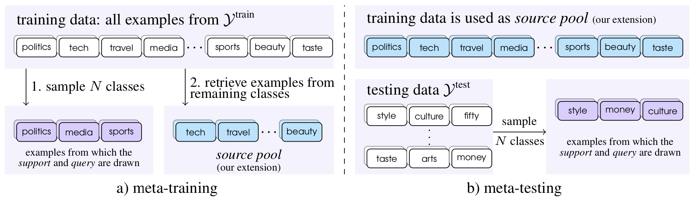

# Few-shot Text Classification with Distributional Signatures

This repository contains the code and data for our ICLR 2020 paper:

*Few-shot Text Classification with Distributional Signatures*. Yujia Bao, Menghua Wu, Shiyu Chang and Regina Barzilay.

If you find this work useful and use it on your own research, please cite our paper.

```
@inproceedings{
	bao2020fewshot,
	title={Few-shot Text Classification with Distributional Signatures},
	author={Yujia Bao and Menghua Wu and Shiyu Chang and Regina Barzilay},
	booktitle={International Conference on Learning Representations},
	year={2020}
}
```

## Overview

Our goal is to improve few-shot classification performance by learning high-quality attention from the distributional signatures of the inputs. Given a particular episode, we extract relevant statistics from the source pool and the support set. Since these statistics only roughly approximate word importance for classification, we utilize an *attention generator* to translate them into high-quality attention that operates over words. This generated attention provides guidance for the downstream predictor, a *ridge regressor*, to quickly learn from a few labeled examples.

For further details on the model and various baselines, please see `src/README.md`.

<p align="center">

</p>

## Data
#### Download

We ran experiments on a total of 6 datasets. You may download our processed data [here](https://people.csail.mit.edu/yujia/files/distributional-signatures/data.zip).

| Dataset | Notes |
|---|---|
| 20 Newsgroups ([link](http://qwone.com/~jason/20Newsgroups/ "20 Newsgroups")) | Processed data available. We used the `20news-18828` version, available at the link provided.
| RCV1 ([link](https://trec.nist.gov/data/reuters/reuters.html "RCV1")) | Due to the licensing agreement, we cannot release the raw data. Instead, we provide a list of document IDs and labels. You may request the dataset from the link provided. |
| Reuters-21578 ([link](https://kdd.ics.uci.edu/databases/reuters21578/reuters21578.html "Reuters")) | Processed data available. |
| Amazon reviews ([link](http://jmcauley.ucsd.edu/data/amazon/ "Amazon")) | We used a subset of the product review data. Processed data available. |
| HuffPost&nbsp;headlines&nbsp;([link](https://www.kaggle.com/rmisra/news-category-dataset "HuffPost")) | Processed data available. |
| FewRel ([link](https://thunlp.github.io/fewrel.html "FewRel")) | Processed data available.

#### Format

- Each JSON file contains one example per line. With the exception of RCV1, each example has keys `text` and `label`. `text` is a list of input tokens and `label` is an integer, ranging from 0 to the number of classes - 1.
- For RCV1, we are unable to distribute the original data. In place of input tokens, each example specifies a `path`, which corresponds to each example's file path in the data distribution.
- Class splits for each dataset may be found in `src/dataset/loader.py`.

### Quickstart
Run our model with default settings. By default we load data from `data/`.
```
./bin/our.sh
```
Scripts for other baselines may be found under `bin/`.

## Code
`src/main.py` may be run with one of three modes: `train`, `test`, and `finetune`.
- `train` trains the meta-model using episodes sampled from the training data.
- `test` evaluates the current meta-model on 1000 episodes sampled from the testing data.
- `finetune` trains a fully-supervised classifier on the training data and finetunes it on the support set of each episode, sampled from the testing data.


#### Dependencies
- Python 3.7
- PyTorch 1.1.0
- numpy 1.15.4
- torchtext 0.4.0
- pytorch-transformers 1.1.0
- termcolor 1.1.0
- tqdm 4.32.2

### Mac OS
As tryambak007 pointed out, there is an error when using multiprocessing.Queue. Please check out his fork (https://github.com/tryambak007/Distributional-Signatures) for the fix.
